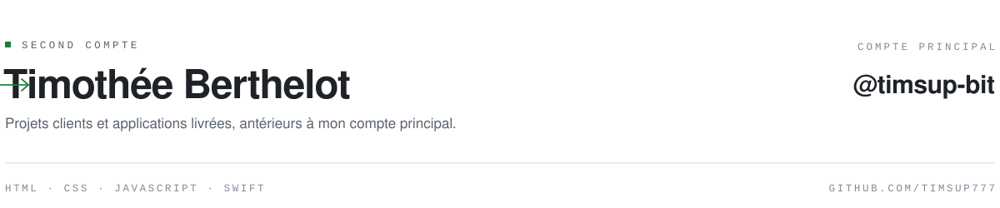

<picture>
  <source media="(prefers-color-scheme: dark)" srcset="assets/header-dark.svg">
  
</picture>

Ce compte héberge mes premiers projets d'école. Je ne le mets plus à jour.

**Tout se passe désormais sur [@timsup-bit](https://github.com/timsup-bit)** — Crash Radar AI,
CFP, Bénévolat, et ce que je construis en ce moment.
