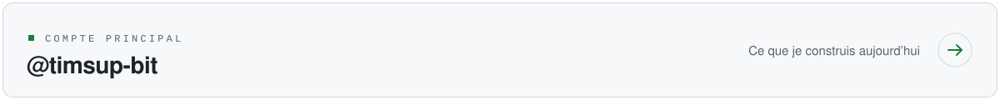

<picture>
  <source media="(prefers-color-scheme: dark)" srcset="assets/header-dark.svg">
  
</picture>

Ce compte garde les projets que j'ai livrés avant. Tout ce que je construis
aujourd'hui est sur mon compte principal.

<a href="https://github.com/timsup-bit">
  <picture>
    <source media="(prefers-color-scheme: dark)" srcset="assets/bouton-vers-timsup-bit-dark.svg">
    
  </picture>
</a>

## Ce qu'il y a ici

**[Affûteur à Vélo](https://github.com/timsup777/AFT)** · [site en ligne](https://aft-opal.vercel.app) 
Site vitrine pour un artisan affûteur rémouleur qui affûte à domicile, à vélo, dans Paris.

**[Mon Mentale](https://github.com/timsup777/-mon-mentale)** 
Application iOS de prise de rendez-vous avec des psychologues et psychiatres, dans l'esprit
de Doctolib. Client Swift, backend Node et Firestore.

**[Activités jeunesse](https://github.com/timsup777/activites-jeunesse)** 
Application front et back, déployée sur Vercel et Railway.

**[Trouvaille](https://github.com/timsup777/trouvaille-website)** 
Page vitrine, servie sur son propre domaine.
